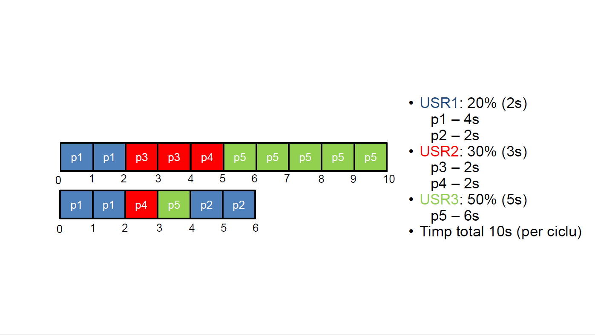
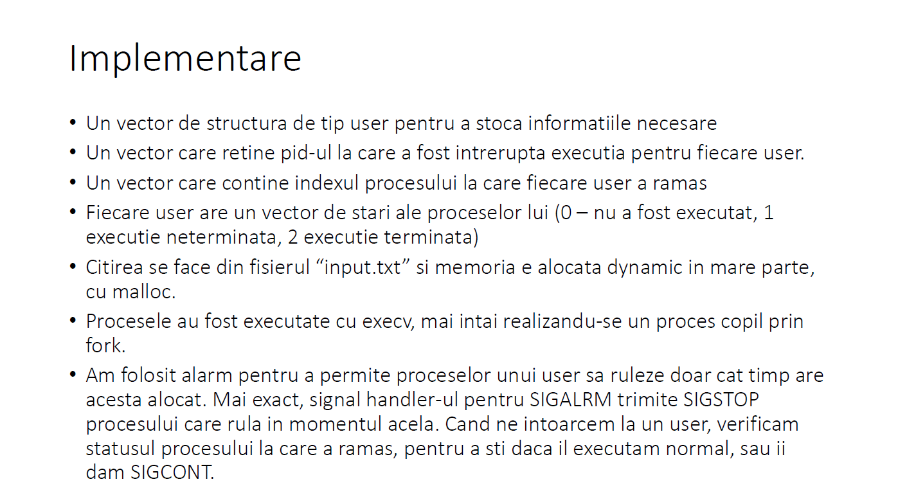
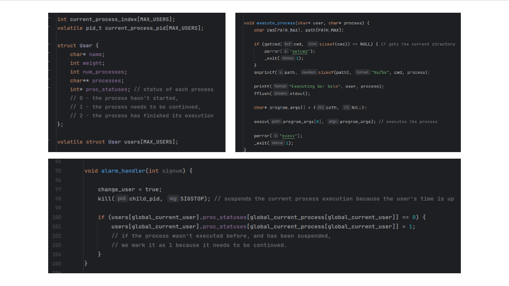
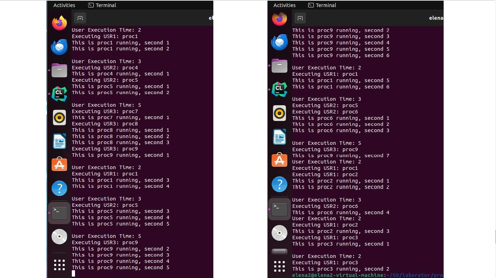

# OS Project
 OperatingSystems Project: User weighted RoundRobin

## [RO] Proiect Sisteme de Operare
Nume Proiect: UserSched (User Scheduler)

Cerinte proiect:
Implementarea unui user weighted round-robin scheduler: algoritmul parcurge lista de utilizatori cu procese gata de executie in ordine round-robin. O data ales un utilizator, algoritmul alege un proces apartinanad acestuia si il lasa sa se execute un timp finit. Utilizatorii au o pondere asociata care dicteaza timpul de executie permis.

